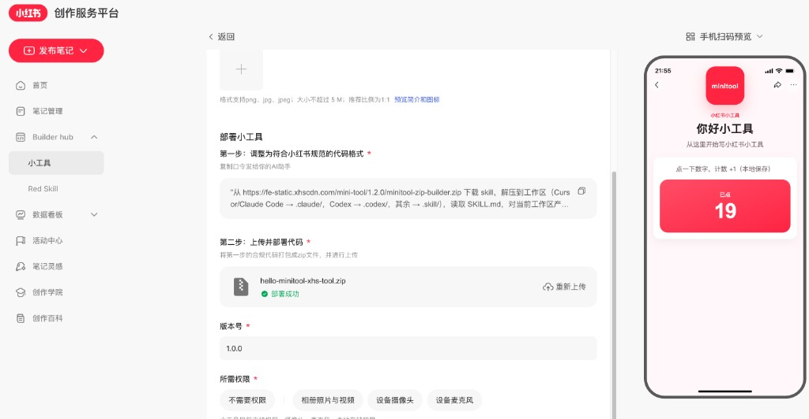

# 小红书小工具 Monorepo

基于 **Vite + 原生 JS** 的小红书小工具脚手架与 demo 集合。用 pnpm workspace 管理多个工具，共享同一套构建、打包与静态校验流水线。

- GitHub：https://github.com/wenyuanw/xhs-minitool
- npm：https://www.npmjs.com/package/create-xhs-minitool
- 官网：https://xhs-minitool.wenyuanw.me

## 创作服务平台预览

在 [小红书创作服务平台](https://creator.xiaohongshu.com/new/red-app) 上传 zip 并部署后的预览示意（示例：`hello-minitool`）：



## npx 创建独立项目

发布到 npm 后（或本地 link 后）：

```bash
npx create-xhs-minitool
npx create-xhs-minitool --name my-tool --title '我的工具' --theme-color '#FF2442'
```

相关包：

| 包名 | 作用 |
|---|---|
| `create-xhs-minitool` | 脚手架 CLI |
| `xhs-minitool-vite-config` | Vite IIFE 配置 |
| `xhs-minitool-pack` | 整理 `xhs-tool` + zip |
| `xhs-minitool-validate` | 静态校验 |

发布前自检：`pnpm release:check`。

## 发版（版本 + Changelog + npm）

四个工具包**同版本**发布。根目录有自动化脚本：

```bash
# 1) bump 版本并写入 CHANGELOG（可选自动 commit / tag）
pnpm release prepare patch -m "Fix phone preview height" --commit --tag

# 2) 推到 GitHub
git push && git push --tags

# 3) 按依赖顺序发布到 npm（需已 npm login / token；2FA 时加 --otp）
pnpm release publish --otp=123456
```

一条龙（本地准备 + 发布）：

```bash
pnpm release patch -m "Fix phone preview height" --commit --tag --publish --otp=123456
```

也可用 `minor` / `major` 代替 `patch`。说明文字会进入 [CHANGELOG.md](CHANGELOG.md)。

## 目录

```text
.agents/skills/       # Agent skills（规范与 reference）
apps/                 # 各小工具 + website 官网
packages/
  create-minitool        # = create-xhs-minitool
  minitool-vite-config
  minitool-pack
  minitool-validate
```

## 要求

- Node `>= 18.17`
- pnpm `>= 9`
- Python 3（校验）
- 系统 `zip` / `zipinfo`
- 部署官网：Cloudflare 账号 + `wrangler login`

## Monorepo 内开发

```bash
pnpm install
pnpm create-minitool          # 写入 apps/<name>（workspace 依赖）
pnpm --filter <name> dev
pnpm --filter <name> build
pnpm --filter <name> validate
```

根脚本：

| 命令 | 作用 |
|---|---|
| `pnpm dev` | 启动内置示例 `hello-minitool` |
| `pnpm build` | 构建全部小工具（不含网站） |
| `pnpm validate` | 校验全部小工具 |
| `pnpm create-minitool` | 在 monorepo 内新建工具 |
| `pnpm site:dev` | 同步 demos 并启动 Astro 官网 |
| `pnpm site:build` | 构建工具 + 官网 |
| `pnpm site:deploy` | 构建并 `wrangler deploy` |
| `pnpm release:check` | 对各 package 做 pack dry-run |

## 官网

线上：https://xhs-minitool.wenyuanw.me

[`apps/website`](apps/website) 为 Astro 纯静态站，部署到 Cloudflare Workers Static Assets：

```bash
pnpm site:dev      # http://localhost:4321
pnpm site:deploy   # 需已 wrangler login
```

站点内容：文档、`/demos` 列表，以及各工具静态预览 `/preview/<name>/`。

## 示例应用

- [`apps/hello-minitool`](apps/hello-minitool) — 模板脚手架内置示例
- [`apps/shu-emoji`](apps/shu-emoji) — 薯 Emoji

## 开发规范

- `.agents/skills/minitool-zip-builder/` — zip 产物规范
- `.agents/skills/xiaohongshu-mini-tool-dev/` — 容器能力与审查清单

新项目优先 `npx create-xhs-minitool` 或 monorepo 内 `pnpm create-minitool`。
